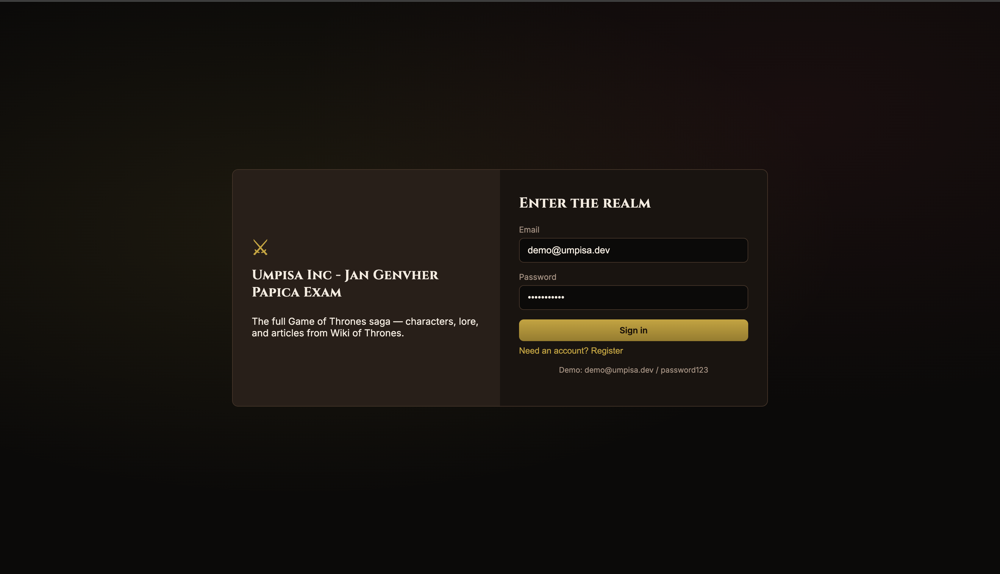
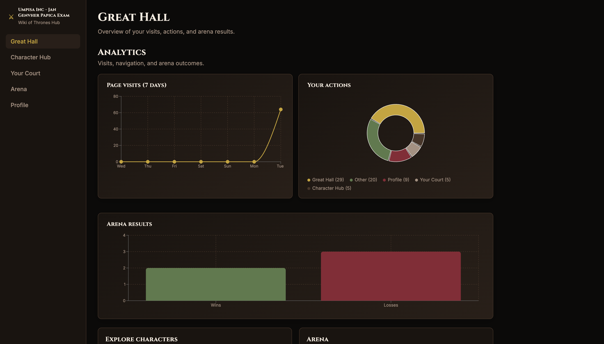
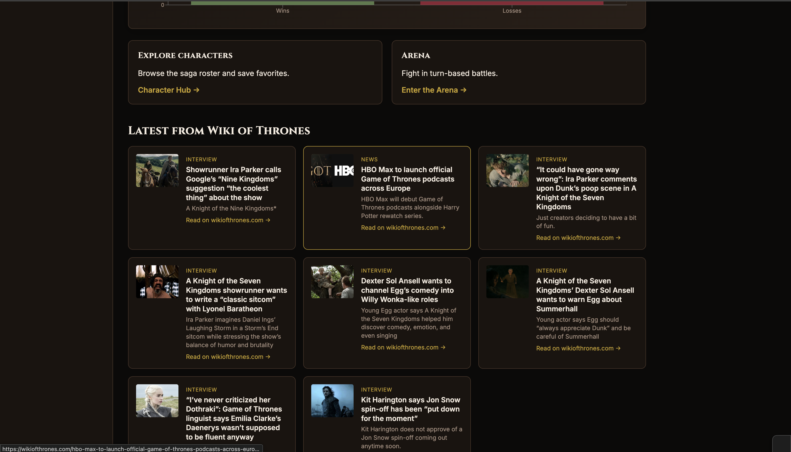
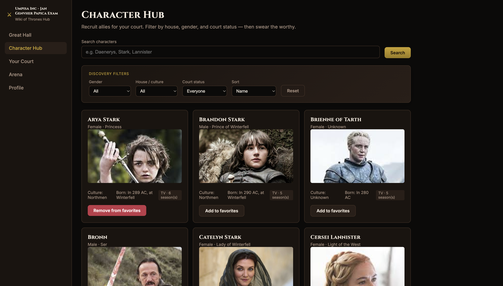
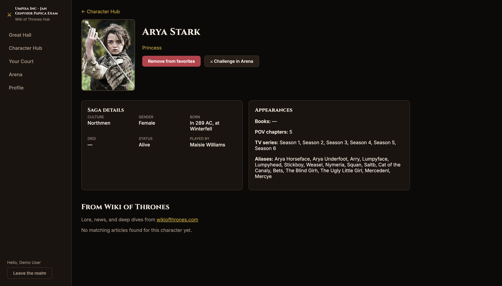
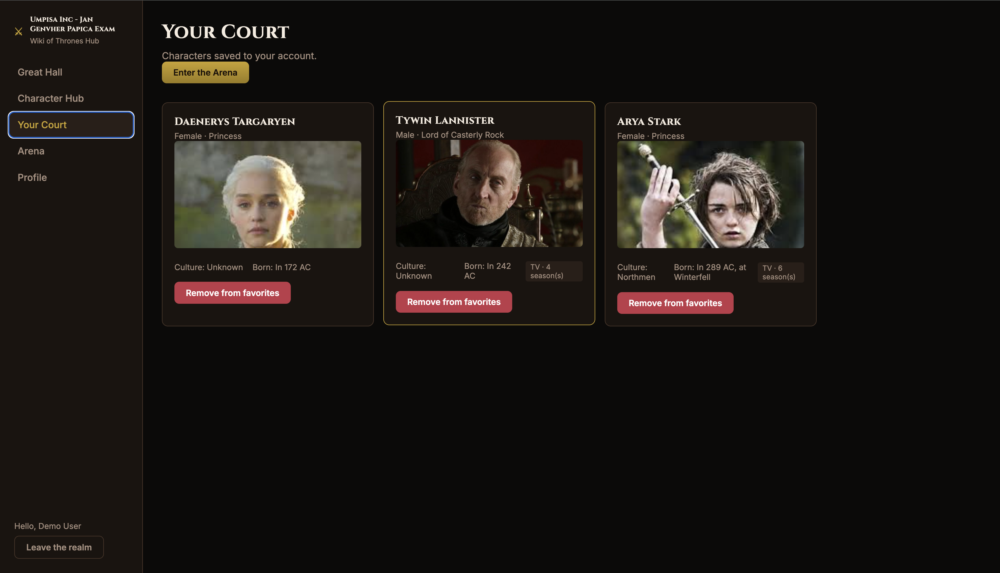
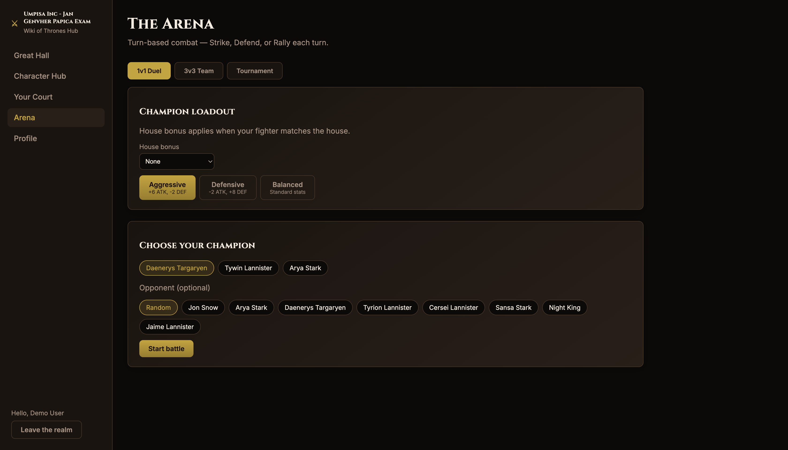
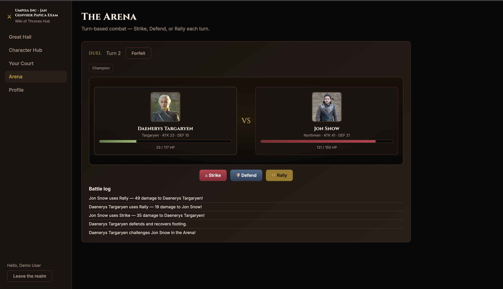
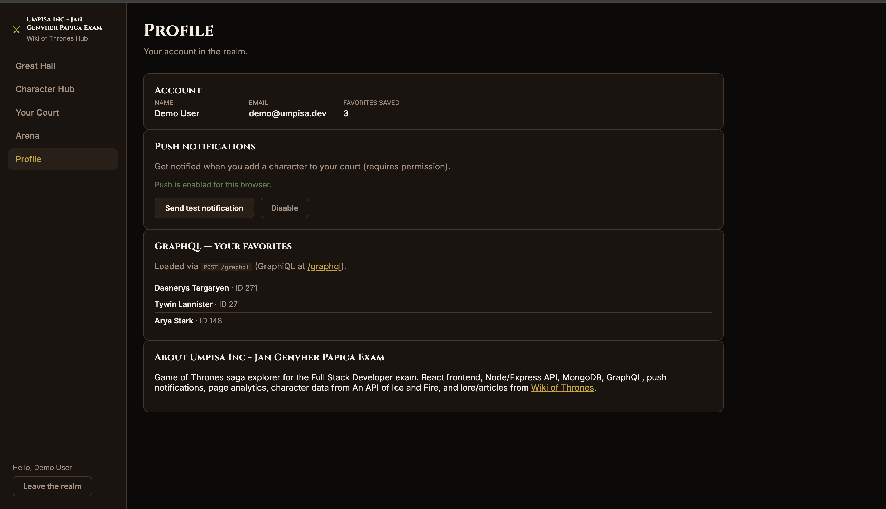

# Game of Thrones Wiki

Personal full-stack project by **Jan Genvher Papica** — a Game of Thrones saga hub for browsing characters, reading Wiki of Thrones lore, saving favorites to your court, and fighting in the Arena.

Live source: [github.com/janvher/Game-of-Thrones-Wiki](https://github.com/janvher/Game-of-Thrones-Wiki)

## What it does

- JWT authentication (register / login)
- Great Hall, Character Hub, Character Detail, Your Court, Profile, and Arena
- Explore workflow (browse → detail → wiki) and Collection workflow (favorites)
- Ice and Fire + Wiki of Thrones + Thrones API
- Protected React Router screens
- MongoDB for users, favorites, and page-view analytics
- GraphQL, Web Push, and a turn-based Arena combat mode

## Screens

- **Great Hall** — charts (visits, actions, arena results), lore feed
- **Character Hub** — 3×3 paginated roster with portraits
- **Character Detail** — saga fields, status, linked wiki articles
- **Your Court** — saved favorites
- **Profile** — account, push notifications, GraphQL favorites panel
- **Arena** — turn-based combat (Strike / Defend / Rally), duel / team / tournament modes

## Quick start

### Docker (recommended)

```bash
docker compose up --build
```

| Service | URL |
|---------|-----|
| Frontend | http://localhost:5173 |
| API health | http://localhost:3001/api/health |
| GraphiQL (dev) | http://localhost:3001/graphql |

### Local development

**Prerequisites:** Node.js 20+, MongoDB 7+

```bash
npm install && npm run install:all
cp backend/.env.example backend/.env

docker run -d -p 27017:27017 --name thrones-mongo mongo:7   # if MongoDB not running
npm run dev
```

> Stop Docker on port 3001 before local backend: `docker compose down`

### Tests

```bash
npm test
```

## Demo account

| | |
|---|---|
| Email | `demo@thrones.app` |
| Password | `password123` |

## REST API

| Method | Path | Description |
|--------|------|-------------|
| POST | `/api/auth/login` | Login |
| POST | `/api/auth/register` | Register |
| GET | `/api/characters` | Paginated characters (`page`, `pageSize`, `search`) |
| GET | `/api/characters/:id` | Detail + wiki articles |
| GET | `/api/wiki/hub` | Latest Wiki of Thrones posts |
| GET | `/api/wiki/lore` | Lore category posts |
| GET/POST/DELETE | `/api/favorites` | Favorites |
| POST | `/graphql` | GraphQL (Bearer token) |
| GET | `/api/push/vapid-public-key` | Web Push public key |
| POST | `/api/push/subscribe` | Register push subscription |
| POST | `/api/push/test` | Test notification |
| POST | `/api/analytics/page-view` | Track navigation |
| GET | `/api/analytics/summary` | Top visited paths |

**GraphQL example** (header: `Authorization: Bearer <token>`):

```graphql
query { favorites { characterId characterName } }
```

**Push:** Profile → Enable push → add a favorite to trigger a notification.  
Optional: `npm run generate-vapid --prefix backend` then copy keys to `backend/.env`.

---

## Stack

### Frontend

| Technology | Purpose |
|------------|---------|
| **React 18** | UI components and screen composition |
| **TypeScript** | Type-safe props, API models, and fewer runtime bugs |
| **Vite** | Fast dev server and production bundling |
| **React Router v7** | Client-side routing and protected screens |
| **Context API** | Global auth session (token, user) |
| **CSS (global)** | Layout, 3×3 grid, cards, and app theme |
| **Service Worker** (`/sw.js`) | Receives Web Push events in the browser |

### Backend

| Technology | Purpose |
|------------|---------|
| **Node.js** | JavaScript runtime for the API server |
| **Express** | HTTP routes, middleware, and REST endpoints |
| **TypeScript** | Shared types across services, routes, and tests |
| **Zod** | Validates query/body input before handlers run |
| **JWT** (`jsonwebtoken`) | Stateless login tokens for protected routes |
| **bcryptjs** | Hashes passwords before storing in MongoDB |
| **GraphQL Yoga** | GraphQL API + GraphiQL explorer |
| **web-push** | Sends browser notifications when favorites change |
| **tsx** | Runs TypeScript directly in development |

### Database

| Technology | Purpose |
|------------|---------|
| **MongoDB 7** | Document store for users, favorites, push subscriptions, and page views |
| **Mongoose** | Schemas, queries, and indexes on MongoDB collections |

This project uses **MongoDB (NoSQL)**. Data is stored as JSON-like documents.

### External APIs

| API | Purpose |
|-----|---------|
| [An API of Ice and Fire](https://anapioficeandfire.com/) | Character names, houses, books/TV metadata |
| [Wiki of Thrones](https://wikiofthrones.com/) (WordPress REST) | Lore articles and news on character detail & dashboard |
| [Thrones API](https://thronesapi.com/) | TV cast portrait URLs for character cards |

### DevOps & tooling

| Technology | Purpose |
|------------|---------|
| **Docker Compose** | Runs MongoDB, API, and frontend together |
| **Nginx** (frontend image) | Serves built React app and proxies `/api` to the backend |
| **concurrently** | Runs backend and frontend with one `npm run dev` |
| **Vitest** | Unit tests for API helpers and UI components |
| **Supertest** | HTTP integration tests against Express routes |

---

## Gallery

Screens from the app: login, browsing the saga, favorites, analytics, and arena combat.

- **Login** — sign-in and demo account entry.
- **Great Hall** — analytics charts (visits, actions, arena results) and Wiki of Thrones feed.
- **Explore** — Character Hub filters and character detail with wiki links.
- **Your Court** — saved favorites.
- **Arena** — champion setup and live turn-based battle.
- **Profile** — account, push notifications, and GraphQL favorites.

---

## Login

| [](Screenshots/login.png) |
|:---:|
| Login — Enter the realm |

---

## Great Hall

| [](Screenshots/great-hall-analytics.png) | [](Screenshots/great-hall-wiki.png) |
|:---:|:---:|
| Analytics (visits, actions, arena results) | Latest from Wiki of Thrones |

---

## Explore

| [](Screenshots/character-hub.png) | [](Screenshots/character-detail.png) |
|:---:|:---:|
| Character Hub — search and filters | Character detail — saga fields and arena challenge |

---

## Your Court

| [](Screenshots/your-court.png) |
|:---:|
| Saved characters with quick links to the Arena |

---

## Arena

| [](Screenshots/arena-setup.png) | [](Screenshots/arena-battle.png) |
|:---:|:---:|
| Duel setup, loadout, and champion select | Turn-based combat (Strike / Defend / Rally) |

---

## Profile

| [](Screenshots/profile.png) |
|:---:|
| Account, push notifications, and GraphQL favorites |
